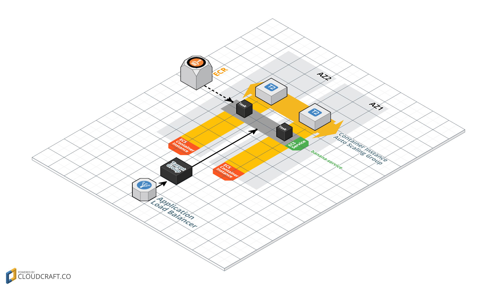

# Overview
This repository contains a lab for the [mu](https://github.com/stelligent/mu) workshop.  The goal of this lab is to run a simple spring boot microservice on ECS.




# Workspace setup

First, the following prerequisites should be installed on your machine:

* **aws-cli**: [Install](http://docs.aws.amazon.com/cli/latest/userguide/installing.html) and [configure](http://docs.aws.amazon.com/cli/latest/userguide/cli-chap-getting-started.html#cli-quick-configuration)
* **git**: Any git cli will do, however we will be using AWS CodeCommit for our source code.  In order to use https URLs, you'll need to configure git to use the AWS CLI for generating temporary credentials:

```
git config --global credential.helper '!aws codecommit credential-helper $@'
git config --global credential.UseHttpPath true
```
* **ssh**: Any ssh client will do.  You will need have a [key](https://help.github.com/articles/generating-a-new-ssh-key-and-adding-it-to-the-ssh-agent/) to explore the instances that mu creates.  The key needs to be imported into AWS via:

```
aws ec2 import-key-pair --key-name mu-key --public-key-material "$(cat ~/.ssh/id_rsa.pub)"
```

* **mu**: `curl -s http://getmu.io/install.sh | sh`


# Pull down banana service
Let's start by pulling down the sample spring boot microservice:

```
git clone git@github.com:stelligent/mu-workshop-lab1.git banana-service

cd banana-service
```

Now, let's create a CodeCommit repo in our AWS account and push the service to the new CodeCommit repo.  If you are working a region other than **us-east-1**, then be sure to update the URL for the CodeCommit repo:

```
aws codecommit create-repository --repository-name banana-service

git remote set-url origin https://git-codecommit.us-east-1.amazonaws.com/v1/repos/banana-service
```

# Initialize mu.yml
We want to setup our `mu.yml` file so that mu can manage our service.  The easiest way to start is with `mu init`.  This doesn't actually do anything in your AWS account, just in your local mu.yml file.  Pass the `--env` flag to have mu also setup the environment for your service:

```
mu init --env
```

This generates 2 new files, `mu.yml` and `buildspec.yml`.  We need to make some updates to both to reflect run our microservice.

# Configure environments
Use the [Environments](https://github.com/stelligent/mu/wiki/Environments#configuration) section of the wiki to configure the following for your environments:

* ECS container instance type: Configure as **m4.large**
* EC2 keypair: Configure as **mu-key** that we imported earlier

# Configure service
Use the [Services](https://github.com/stelligent/mu/wiki/Services#configuration) section of the wiki to configure the following for your service:

* Path pattern: update to only route `/bananas/*`

# Configure pipeline
Use the [Pipelines](https://github.com/stelligent/mu/wiki/Pipelines#configuration) section of the wiki to configure the following for your service pipeline:

* Build image: Update the [image](http://docs.aws.amazon.com/codebuild/latest/userguide/build-env-ref.html#build-env-ref-available) that CodeBuild uses to `aws/codebuild/java:openjdk-8`

# Configure CodeBuild
Update the [buildspec.yml](http://docs.aws.amazon.com/codebuild/latest/userguide/build-spec-ref.html#build-spec-ref-syntax) to run `gradle build`.

# Push changes to CodeCommit
```
git add --all
git commit -m "mu init"
git push
```

# Create Pipeline
Now that our service is ready to deploy, let's create a pipeline for the service:

```
mu pipeline up
```

# Explore and wait...
While we wait for the pipeline to run, let's explore what mu created:

* **CodePipeline console** - Open the AWS console and navigate to CodePipeline.  Check out the different stages and actions in the pipeline.
    * What is the difference between the *Artifact* and *Image* actions in the *Build* stage?
    * What `mu` commands are being run in the *Deploy* actions?

* **mu cli** - Monitor the progress of the pipeline with `mu`
    * How can you view the logs from the CodeBuild executions [hint](https://github.com/stelligent/mu/wiki/Pipelines#commands)?
    * How can you see the status of the pipeline with `mu` [hint](https://github.com/stelligent/mu/wiki/Services#commands)?

* **CloudFormation console** - Open the AWS console and navigate to CloudFormation.  Check out the different stacks and resources created.
    * What is the difference between the pipeline, vpc, cluster and service stacks?
    * Is it possible to target an existing VPC rather than have mu create the VPC [hint](https://github.com/stelligent/mu/wiki/Environments#configuration)?
    * Check out the subnets in the VPC console.  Are the ECS subnets public or private?  ELB subnets?

* **ECS console** - Open the AWS console and navigate to ECS.  Check out the cluster that was created.
    * How many tasks are running for the service?
    * What % of the memory reservation is the service using?  Is that ok?
    * What does the memory and cpu reservation look like for the ECS instances?

* **Service output** - Use `mu` to view the logs for your service.
    * Do you see any errors in the service logs [hint](https://github.com/stelligent/mu/wiki/Services#commands)?
    * What do the errors mean?

* **EC2 instances** - Use the bastion host that `mu` created to login to your ECS instance
    * Get the bastion host and ECS instance IP via `mu env show dev`
    * Login to bastion host `ssh -i ~/.ssh/id_rsa ec2-user@<bastion-ip>`
    * Login to ECS instance
    * How many docker containers are running? (hint: `docker ps`)
    * How much CPU/memory are the containers using? (hint: `docker stats`)

* **Test the service** - Once the pipeline is successfully deployed to the **dev** environment, test it!
    * Get the base URL of the ELB via `mu env show dev`
    * Test the service via `curl <baseurl>/bananas/`
    * What does the response look like?

